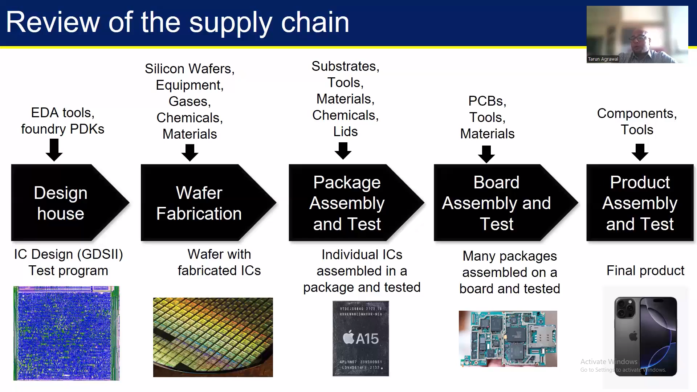
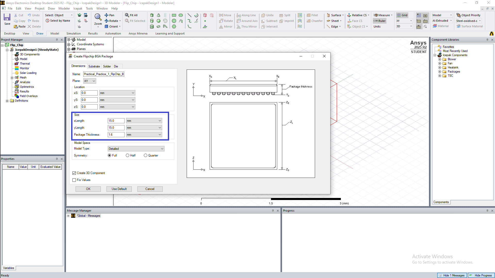
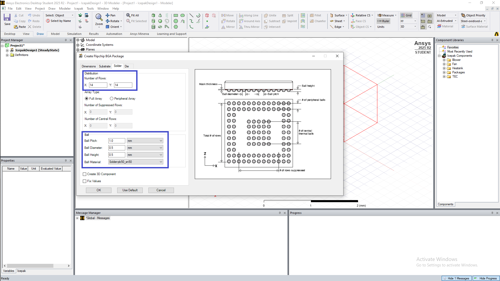
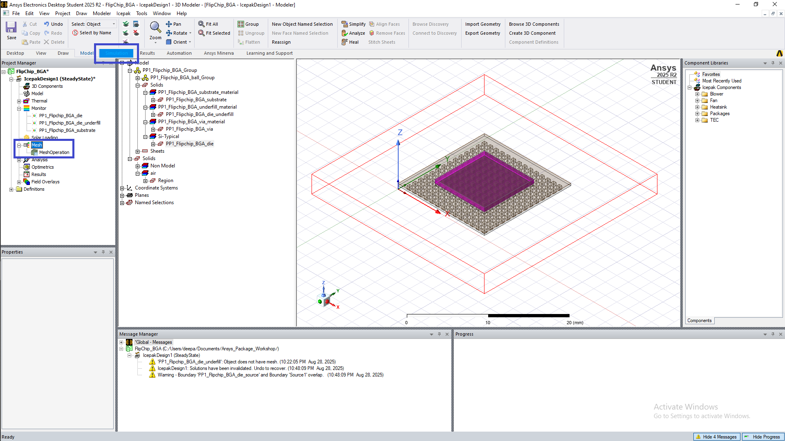
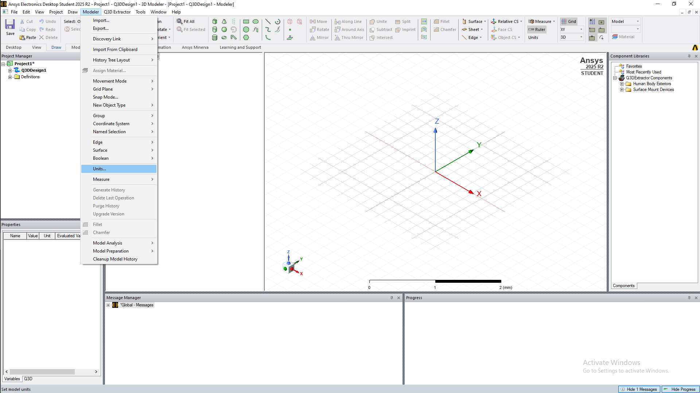
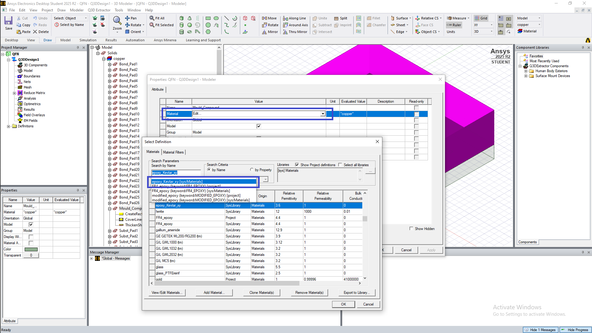

# Semiconductor packaging
This GitHub repository is the documentation of 10 Days Workshop on Semiconductor Packaging - Fundamentals of Design and Testing by VSD Corp. Pvt. Ltd. attended from 15th Aug,2025 -27 Aug, 2025. 
The workshop delivers a full-pipeline of the semiconductor packaging process, starting from the fundamentals and evolution of packaging to advanced 2.5D/3D architectures. I gained insights of  advanced interconnect technologies, RDLs & interposers,  assembly processes, package reliability analysis, and also get hands-on practical experience on thermal simulations, package design and modeling using ANSYS tools.
 

**TOPICS COVERED**

 **Module1: Packaging Evolution: From Basics to 3D Integration**   <ol> <li>[Introduction To Semiconductor Packaging And Industry Overview](#11---introduction-to-semiconductor-packaging-and-industry-overview)</li> <li>[Understanding Package Requirements And Foundational Package Types](#12---understanding-package-requirements-and-foundational-package-types)</li> <li>[Evolving Package Architectures - From Single Chip To Multi-Chip Modules](#13---evolving-package-architectures---from-single-chip-to-multi-chip-modules)</li> <li>[Interposers Re-distribution Layers And 2.5D/3D Packaging Approaches](#14---interposers-re-distribution-layers-and-25d3d-packaging-approaches)</li> <li>[Comparative Analysis And Selecting The Right Packaging Solution](#15---comparative-analysis-and-selecting-the-right-packaging-solution)</li> </ol>
 **Module2: From Wafer to Package: Assembly and Manufacturing Essentials**   <ol> <li>[Setting The Stage - Supply Chain And Facilities](#21---setting-the-stage---supply-chain-and-facilities)</li> <li>[Wafer Pre-Preparation - Grinding And Dicing](#22---wafer-pre-preparation---grinding-and-dicing)</li><li>[Wire Bond Packaging - Die Attach To Molding](#23---wire-bond-packaging---die-attach-to-molding)</li> <li>[Flip Chip Assembly - Bump Formation And Underfill](#24---flip-chip-assembly---bump-formation-and-underfill)</li> <li>[Wafer Level Packaging And Conclusion](#25---wafer-level-packaging-and-conclusion)</li> </ol>
 **Module3: Labs: Thermal Simulation of Semiconductor Packages with ANSYS**   <ol> <li>[Introduction And Getting Started With ANSYS Electronics Desktop](#31---introduction-and-getting-started-with-ansys-electronics-desktop)</li> <li>[Setting Up A Flip-Chip BGA Package](#32---setting-up-a-flip-chip-bga-package)</li> <li>[Material Definitions And Thermal Power Sources](#33---material-definitions-and-thermal-power-sources)</li> <li>[Meshing And Running The Thermal Analysis](#34---meshing-and-running-the-thermal-analysis)</li> <li>[Viewing Results And Exploring Other Package Types](#35---viewing-results-and-exploring-other-package-types)</li> </ol>
 **Module4: Ensuring Package Reliability: Testing and Performance Validation**   <ol> <li>[Introduction to Package Testing and Electrical Functionality Checks](#41---introduction-to-package-testing-and-electrical-functionality-checks)</li> <li>[Reliability and Performance Testing of Semiconductor Packages](#42---reliability-and-performance-testing-of-semiconductor-pack--ages)</li> </ol>
 **Module5: Package Design and Modeling: Building a Semiconductor Package from Scratch**   <ol> <li>[Introduction to Package Cross-Section Modeling in ANSYS Electronics Desktop (AEDT)](#51---introduction-to-package-cross-section-modeling-in-ansys-electronics-desktop-aedt)</li> <li>[Creating the Die and Substrate in AEDT](#52---creating-the-die-and-substrate-in-aedt)</li> <li>[Adding Die Attach Material and Bond Pads](#53---adding-die-attach-material-and-bond-pads)</li> <li>[Wire Bond Creation and Material Assignment](#54---wire-bond-creation-and-material-assignment)</li> <li>[Applying Mold Compound and Finalizing the Package Model](#55---applying-mold-compound-and-finalizing-the-package-model)</li> </ol>
# M1 - Packaging Evolution: From Basics to 3D Integration
Semiconductor packaging is a process of enclosing a fabricated semiconductor chip(die) in a protective case.
Reasons for doing so - 
* Protect it from the physical damage.
* Provides electrical connections between the microscopic circuits on the chip and the real world.
* Manages heat generated by the chip during operation. 
NEEDED WHY?  --> Bare silicon dies are fragile and cannot be directly used in the devices.
* Protection of chip - from physical damage ,moisture,dustand communication. 
* Electrical connections -done between the microscopic bonding pads on the chip and the larger pins or the balls used to connect to a circuit board.
* Heat dissipation - to prevent the overheating during operation.
* Mechanical support - provides a stable from for assembly into devices.
* Standardization - defines the sizer, pin count, and the layout for the compatibility.
  
The key Functions of semiconductor package are:

* Protection from external environmental (physical/ mechanical damage, humidity, corrosion/ contaminants & chemical damage and ESD)
* Electrical connectivity between the die and the external environment via leads (pins, balls or lands)
* Mechanical support and connection of the die to the system
* Thermal dissipation to conduct heat away from the die

## <u>M1-1 - Introduction To Semiconductor Packaging And Industry Overview</u>

  
The semiconductor industry plays a vast role for modern technology — powering everything smartwatches, smartphones, laptops, cars, satellites,etc(anything you can think of) .The semiconductor manufacturing process consists of   * front-end process which refers to the wafer manufacturing, and   * back-end process which consists of packaging and testing.    (Even the wafer manufacturing process is split into a front-end and back-end process - with the front-end typically consisting of the CMOS-making process, and the back-end comprising the metal wiring formation process that comes after the CMOS is made.)

**Industry Highlights** 
***Global Market Size:*** Over $600 billion annually and growing. 
***Key Players:*** Intel, TSMC, Samsung, Qualcomm, NVIDIA, AMD. 
***Major Segments:***
* Design: Creating chip architecture (e.g., ARM, AMD).
* Fabrication: Manufacturing chips (e.g., TSMC, GlobalFoundries).
* Packaging & Testing: Final assembly and quality checks.
* Equipment & Materials: Tools and chemicals used in production.  

***Trends Shaping the Industry:***
* AI & Machine Learning
* 5G & IoT
* Automotive Electronics0
* Geopolitical Shifts 

The packaging and testing process start with wafer testing. Then, packages are made in the packaging process and followed by the package test stage. 
 

<b>Companies:</b> Nvidia, Qualcomm and Apple  - that only design semiconductors are called <b>fabless</b>.  
   Products designed by fabless companies are made into wafers. The facilities that produce these wafers are called <b>foundries</b>.
   Global companies with these facilities include TSMC, Global Foundries and UMC.  
Companies that test and package products that were designed by fabless vendors and later, made into wafers at foundries are called <b>OSAT (Out-Sourced Assembly and Test)</b> which include companies such as ASE and Amkor.
Companies that do everything from design, wafer production, and packaging, to testing, are called <b>IDMs (Integrated Device Manufacturer)</b>.

## <u>M1-2 - Understanding Package Requirements And Foundational Package Types</u>
### <u>Package Requirements</u>
Semiconductor packages must meet a variety of technical, mechanical, and environmental demands to ensure the chip performs reliably in its intended application. Here are the key requirements

<b>Selecting the right semiconductor package is a critical step in electronic system design, as it affects performance, cost, thermal management, size, and reliability</b>. 
The criteria for semiconductor package selection generally fall into the following key categories:

  - **Application-specific Requirements**
    - Logic/ Memory die
    - Power Semiconductor die
  - **Electrical Requirements**
    - I/O Pin Count
    - <b>Signal Integrity</b> for high speed I/Os
    - <b>Power Delivery</b>
    - Must support high-speed signal transmission with minimal loss.
    - Provide low resistance and inductance paths for power and ground.
    - Ensure <b>Signal Integrity</b> and <b>Electromagnetic Compatibility (EMC)</b>.
  - **Thermal Requirements**
    - <b>Efficient heat dissipation</b> is critical to prevent overheating.
    - Use of heat sinks, thermal vias, or advanced materials like copper or ceramic.
    - Thermal resistance must match the chip’s power output and operating conditions.
  - **Mechanical and Physical constraints**
    - <b>Form Factor:</b> Footprint and chip height requirements for the system
    - <b>System Integration</b> needs: MCM, SiP, 2.5/3D packaging for tighter integration
    - Must be compact and compatible with the final product’s design. (Smaller packages are preferred for mobile and wearable devices.)
  - **Cost Considerations**
    - <b>Package Cost</b>.
    - <b>Board/ System Assembly Cost</b>.
    - <b>Balance between performance and affordability</b>.
    - <b>Material selection and design complexity</b>.
  - **Compatibility**
    - Align with PCB layout, soldering techniques, and system architecture.
    - Standardized interfaces help with integration across platforms.
  - **Reliability and Durability**
    - <b>Mechanical Stress</b>
    - <b>Thermal cycling</b>
    - Moisture and other Environmental Factors
  - **Environmental Resistance**
    - <b>Protection</b> against moisture, dust, and corrosive elements.
      Must comply with industry standards for reliability under harsh conditions (e.g., automotive or aerospace).

### <u>Typical Package</u>
### <u>IC Packages</u> 
A typical Integrated Circuit (IC) package is a carefully engineered structure designed to protect the silicon die and enable its connection to the external world. Here's a breakdown of its main components:

### <u>IC Package Components</u>
<b>Silicon Die (Chip)</b> 
&ensp;The heart of the IC, where all the transistors and circuits reside.
Fabricated on a silicon wafer and then cut into individual dies.

<b>Die Attach</b> 
&ensp;A layer of adhesive or solder that secures the die to the substrate or lead frame.
Ensures mechanical stability and thermal conduction.

<b>Wire Bond or Flip-Chip Bump</b> 
&ensp;<b>Wire Bond:</b> Thin gold or aluminum wires connect the die to the package leads. 
&ensp;<b>Flip-Chip Bump:</b> Uses solder bumps directly on the die for connection, offering better performance.

<b>Substrate or Lead Frame</b> 
&ensp;Acts as the base of the package and provides electrical pathways. 
&ensp;<b>Substrates</b> are used in advanced packages. &ensp;<b>Lead Frames</b> are common in traditional ones.

<b>Encapsulation (Mold Compound)</b> 
&ensp;A protective shell made of epoxy resin or plastic.
Shields the die and wires from environmental damage.

<b>Interconnects (Leads, Balls, Pads)</b>
- External terminals that connect the package to the PCB.
- Can be Pins (DIP), Leads (QFP), or Solder Balls (BGA).

<b>Heat Sink or Thermal Pad (Optional)</b>
- Used in high-power applications to dissipate heat.
- May be integrated into the package or added externally.  

### <u>Mounting Technologies</u>
  - **Through-hole Mounting**
    - <b>TO</b> : Transistor Outline
    - <b>SIP</b> : Single In-line Package
    - <b>DIP</b> : Dual In-line Package
    - <b>PGA</b> : Pin Grid Array
  - **Surface Mount Technology**:
    - <b>(T)SOT</b> : (Thin) Small Outline Transistor
    - <b>(T)SOP</b> : (Thin) Small Outline Package
    - <b>SOIC</b> : Small Outline IC Package
    - <b>QFN</b> : Quad Flat No-leads
    - <b>QFP</b> : Quad Flat Package
    - <b>PBGA</b> : Plastic Ball Grid Array
    - <b>LGA</b> : Land Grid Array
    - <b>FCBGA</b> : Flip Chip Ball Grid Array
    - <B>CSP</b> : Chip Scale Package
  - **Advanced Packages**
    - <b>PoP</b> : Package on Package (Qualcomm SD series, Apple A-Series, Samsung Exynos etc.)
    - <b>MCM</b> : Multi-Chip Module (eg: Intel Broadwell)
    - <b>SiP</b> : System-in-Package (Apple S1)
    - <b>CoWoS</b> : Chip on Wafer on Substrate (eg: Nvidia GP100, GV100, GA100, etc.)
  

## <u>M1-3 - Evolving Package Architectures - From Single Chip To Multi-Chip Modules</u>
### <u>Classification and Anatomy of Semiconductor Packages</u>
The various types of semiconductor packages can be broadly grouped into two main categories:
  - Conventional Packages
  - Wafer-Level Packages

In <b><u>Conventional Packaging</u></b>, the wafer is sawed into dice before the chip is packaged. In <b><u>Wafer-Level Packaging</b></u> involves a part, or all, of the packaging process being performed at the wafer level before proceeding with wafer sawing.

### <u>Evolution of Package Architectures</u>
1. <b>Single-Chip Packages</b>
- Traditional packaging method contains one silicon die per package. Examples: DIP, QFP, BGA.
- Simple, cost-effective, but limited in performance and integration.

2. <b>System-in-Package (SiP)</b>
- Multiple dies integrated into a single package. Enables compact systems with diverse functionalities. Examples: Micro-Controller, Memory, RF, etc
- Ideal for smartphones, wearables, and IoT devices.

3. <b>Multi-Chip Modules (MCMs)</b>
- Multiple dies placed side-by-side or stacked within one package. Dies may be from different process nodes or vendors.
- Offers high bandwidth, low latency, and better power efficiency. Used in high-performance computing, AI accelerators, and servers.

4. <b>2.5D Packaging</b>
- Uses an interposer (usually silicon) to connect multiple dies.
- Improves signal integrity and power delivery. Common in GPUs and data center chips.

5. <b>3D Packaging</b>
- Dies are stacked vertically using Through-Silicon Vias (TSVs).Saves space and boosts performance.
- Ideal for memory integration (e.g., HBM with processors).  

**Why This Evolution Matters**
- <b>Performance Boost</b>: Shorter interconnects mean faster communication.
- <b>Power Efficiency</b>: Reduced parasitics and better thermal management.
- <b>Form Factor Reduction</b>: Smaller, thinner devices.
- <b>Heterogeneous Integration</b>: Mix logic, memory, analog, and RF in one package.  

Depending on the medium of the package, packages can be further categorized into:
  - **Leadframe Based Packages**
    - <b>DIP</b>: Traditional, with wirebonds and external leads
    - <b>QFN</b>: Compact with exposed thermal pads
    - <b>Leadframe CSP & QFP</b>: Scaled for density and SMT

  - **Laminate Based Packages**
    - <b>PBGA</b>: Wirebonded to laminated substrates
    - <b>Flip Chip (PBGA)</b>: Superior signal and thermal performance
    - <b>LGA, FCCSP</b>: Common in modern devices

  - **Advanced Substrates Based Packages**
    - <b>2D</b>: Dies placed side-by-side on the same substrate
    - <b>2.1D</b>: Adds RDL for better routing
    - <b>2.3D</b>: Uses organic interposers
    - <b>2.5D</b>: Silicon interposer for high-speed interconnects (e.g.: CoWoS) Semiconductor Packages 

## <u>Semiconductor Package Types And Their Descriptions</u>

| Package Type | Full Name                      | Mounting Style     | Description                                                                 |
|--------------|--------------------------------|---------------------|------------------------------------------------------------------------------|
| &ensp; &ensp;DIP          | Dual In-line Package           | Through-hole        | Two parallel rows of pins; widely used in prototyping and hobby circuits     |
| &ensp; &ensp;SIP          | Single In-line Package         | Through-hole        | Single row of pins; compact and upright mounting                             |
| &ensp; &ensp;ZIP          | Zig-zag In-line Package        | Through-hole        | Pins arranged in a zig-zag pattern; used for higher density                  |
| &ensp; &ensp;QFP          | Quad Flat Package              | Surface-mount       | Pins on all four sides; ideal for high pin-count ICs                         |
| &ensp; &ensp;QFN          | Quad Flat No-leads             | Surface-mount       | No leads; pads underneath; compact and thermally efficient                   |
| &ensp; &ensp;BGA          | Ball Grid Array                | Surface-mount       | Solder balls underneath; used in high-performance processors                 |
| &ensp; &ensp;LGA          | Land Grid Array                | Surface-mount       | Flat contact pads; common in CPUs and FPGAs                                  |
| &ensp; &ensp;SOP          | Small Outline Package          | Surface-mount       | Smaller than DIP; pins on two sides                                          |
| &ensp; &ensp;TSOP         | Thin Small Outline Package     | Surface-mount       | Thinner version of SOP; used in memory chips                                 |
| &ensp; &ensp;CSP          | Chip Scale Package             | Surface-mount       | Very small; nearly the size of the die itself                                |
| &ensp; &ensp;PLCC         | Plastic Leaded Chip Carrier    | Surface-mount       | J-leads on all four sides; used in older programmable devices                |
| &ensp; &ensp;TO-220       | Transistor Outline Package     | Through-hole        | Metal tab for heat dissipation; used in power transistors and regulators     |
| &ensp; &ensp;SOT-23       | Small Outline Transistor       | Surface-mount       | Tiny package for discrete transistors and diodes                             |
| &ensp; &ensp;SOIC         | Small Outline Integrated Circuit | Surface-mount     | Shrunk version of DIP; common in analog and digital ICs                      |

## <u>M1-4 - Interposers, RDLs And 2.5D/3D Packaging Approaches</u>
## <u>Redistribution Layers (RDL)</u>

<b>RDLs (Redistribution Layers)</b> is a metal layer added on top of a die or wafer to reroute the I/O pads to new locations. This enables more flexible bump layouts, especially important for fan-out packages or wafer-level chip scale packaging (WLCSP).

### Application
  - Fan-out wafer-level packaging (FO-WLP, FO-BGA)
  - Panel-level packaging (PLP)
  - Multi-die integration
  - System-in-Package (SiP)

### Advantages
  - Allows larger bump pitch for finer pad layouts
  - Reduces package size and thickness
  - Enables multi-chip placement and interconnect on a single substrate

### <u>Interposers</u>
An interposer is a passive or active layer inserted between the die and the substrate, acting as an intermediate routing interface. It enables dense signal routing, power delivery, and die-to-die interconnect.

  - <b>Types</b>:
    - Silicon
    - Organic
    - Glass

  - <b>Functions</b>:
    - Enables fan-out packaging and improves signal routing flexibility
    - Routes signals between multiple dies (e.g., chiplets)
    - Provides thermal expansion management
    - Enables high bandwidth communication
     
  - <b>Passive vs Active Interposers</b>:
    - <b>Passive</b>: No logic, just routing and vias
    - <b>Active</b>: Includes power delivery, clocking, or even memory logic  

### <u>2.5D/3D Integration</u>
  - <b>2.5D</b>:
    - Multiple dies (e.g., CPU + HBM) placed side-by-side on a common interposer.
    - Interposer provides connectivity, not the substrate directly. Popular in HPC and AI (e.g., AMD Instinct, NVIDIA GPUs with HBM).
    - Structure: Multiple dies placed on a shared interposer.
    - Benefits: High bandwidth, low latency, and heterogeneous integration.
    - Example: AMD’s chiplet-based CPUs.
  - <b>3D</b>:
    - Dies are stacked vertically, interconnected through Through-Silicon Vias (TSVs). 3D NAND, HBM memory stacks, logic-on-logic stacking.
    - Structure: Multiple dies placed on a shared interposer.
    - Benefits: High bandwidth, low latency, and heterogeneous integration.
    - Example: AMD’s chiplet-based CPUs.

## <u>M1-5 - Comparative Analysis And Selecting The Right Packaging Solution</u>
The following table provides a comparison of the various IC package types and their typical applications:

### <u>IC Package Types and Applications</u>

| Package Type | Full Name                      | Mounting Style     | Typical Applications                                      |
|--------------|--------------------------------|---------------------|------------------------------------------------------------|
| DIP          | Dual In-line Package           | Through-hole        | Prototyping, educational kits, legacy circuits             |
| SIP          | Single In-line Package         | Through-hole        | Simple logic ICs, vertical board mounting                  |
| QFP          | Quad Flat Package              | Surface-mount       | Microcontrollers, DSPs, GPUs                               |
| QFN          | Quad Flat No-leads             | Surface-mount       | Power management ICs, RF modules, compact electronics      |
| BGA          | Ball Grid Array                | Surface-mount       | CPUs, FPGAs, high-speed computing                          |
| LGA          | Land Grid Array                | Surface-mount       | Server processors, embedded systems                        |
| SOP          | Small Outline Package          | Surface-mount       | Memory chips, analog ICs                                   |
| TSOP         | Thin Small Outline Package     | Surface-mount       | Flash memory, DRAM                                         |
| CSP          | Chip Scale Package             | Surface-mount       | Mobile devices, wearables                                  |
| PLCC         | Plastic Leaded Chip Carrier    | Surface-mount       | Programmable logic devices, older telecom systems          |
| TO-220       | Transistor Outline Package     | Through-hole        | Voltage regulators, power transistors                      |
| SOT-23       | Small Outline Transistor       | Surface-mount       | Discrete transistors, diodes                               |
| SOIC         | Small Outline Integrated Circuit | Surface-mount     | General-purpose ICs, analog/digital converters             |

Comparative Analysis And Selecting The Right Packaging Solution  

Choosing the right packaging solution is a strategic decision that affects product safety, brand perception, cost efficiency, and environmental impact.

### <u>Key Packaging Materials Compared</u>

| Packaging Type        | Pros                                                                 | Cons                                                              |
|-----------------------|----------------------------------------------------------------------|-------------------------------------------------------------------|
| Shrink Film           | - Excellent protection from dust/moisture - Transparent for easy scanning - Durable and puncture-resistant | - Requires heat to apply - Often non-biodegradable             |
| Stretch Film          | - Great for pallet security - Easy to use - Cost-effective     | - Limited protection for individual items                         |
| Bubble Wrap           | - Superior cushioning for fragile items - Lightweight             | - Bulky - Not eco-friendly unless recycled                     |
| Cardboard             | - Versatile and recyclable - Good structural support              | - Susceptible to moisture damage                                  |
| Biodegradable Options | - Eco-friendly - Enhances brand image with sustainability         | - May be costlier - Limited durability for heavy-duty use      |

Selecting the right semiconductor packaging depends on multiple criteria across performance, reliability, form factor and cost.  
 

# <u>M2 - From Wafer to Package: Assembly and Manufacturing Essentials</u>
This section covered the semiconductor supply chain and provided a detailed look into a package manufacturing unit (<b>ATMP – Assembly, Testing, Marking, and Packaging)</b>.

## <u>M2-1 - Setting The Stage - Supply Chain And Facilities</u>
### <u>Semiconductor Supply Chain Overview</u>
The semiconductor supply chain is a multi-step process that transforms raw silicon into fully functional electronic products. The major steps are - 

<b>1. Design : Chip design and verification</b>
  - <b>Input</b>: Product requirements specification, EDA tools, Foundry PDKs, IPs
  - <b>Output</b>: GDSII layout file is _taped out_ to the foundry for mask creation and wafer fabrication. Test programs are also provided by the Design house for Wafer and Package level testing.
  - <b>Examples</b>: Nvidia, AMD, MediaTek, Intel, TI, Apple, ARM etc.

<b>2. Wafer Fabrication (Foundry) : Physical ICs are manufactured onto wafers using photolithography and other processes</b>
  - <b>Input</b>: GDSII layout, Silicon wafers, Equipment, Gases, chemicals, Materials
  - <b>Output</b>: Processed wafers with patterned dies.
  - <b>Examples</b>: TSMC, Samsung, Intel, GlobalFoundries

<b>3. Packaging Assembly & Test : ICs are cut (diced), bonded, encapsulated, and tested</b>
  - <b>Input</b>: Test programs, Singulated dies, substrate materials (e.g., ABF, BT resin), solder bumps
  - <b>Output</b>: Packaged IC (e.g., BGA, QFN, FCBGA, 2.5D/3D)
  - <b>Examples</b>: ASE, Amkor, JCET, Shinko, Ibiden

<b>4. Board Assembly & Test : Multiple packaged ICs are mounted and board-level validation</b>
  - <b>Input</b>: Packaged ICs, test programs, ATE systems
  - <b>Output</b>: Qualified ICs, binned by performance. Yield improvement and binning are critical for profitability.
  - <b>Examples</b>: ASE, Powertech, Amkor, UTAC

<b>5. System Integration & Distribution</b> 
  - <b>Input</b>: Packaged, tested ICs; PCBs; passive components
  - <b>Process</b>: SMT assembly, system-level integration, validation
  - <b>Output</b>: Complete electronic systems (e.g., smartphones, servers)
  - <b>Examples</b>: OEMs Original Equipment Manufacturer (Apple, Cisco), ODMs Original Design Manufacturer (Foxconn, Pegatron), EMS Electronics Manufacturing Services (Flex, Jabil)

### <u>Introduction to a Package Manufacturing Unit (ATMP)</u>

The ATMP process involves four core activities-
  - Assembly
  - Testing
  - Marking
  - Packaging 
The ATMPs could be OSATs (like ASE, Amkor, TATA etc.) or in-house ATMPs of IDMs (like Intel, Samsung, Micron) or Foundries (like TSMC, Samsung Foundry)  

### <u>Layout of an ATMP Unit</u>

  1. <b>Material Preparation and Storage</b>
    - Incoming Wafers, Substrates, Leadframes, Mold Compounds, Consumables
  2. <b>Processing Zone (Clean Room: ISO Class 6 & 7)</b>
    - Major activities - 
      - Die Attach & Mount
      - Wire or Flip-Chip Bonding
      - RDL formation
      - Encapsulation / molding
  3. <b>Testing Area</b>
    - Electrical Tests
    - Burn-in Test
    - Reliability chamber testing
  4. <b>Warehouse</b>
    - Storage of packaged ICs

## <u>M2-2 - Wafer Pre-Preparation - Grinding And Dicing</u>
This section explained the wafer preparation process inside an ISO Class 7 cleanroom of an ATMP (Assembly, Testing, Marking, and Packaging) facility. 

  1. <b>Incoming Wafer Carrier</b>: Wafers arrive in a protective carrier that ensures they remain uncontaminated before entering the processing line.
  2. <b>Wafer Inspection</b>: The wafers are visually and optically inspected for surface defects, contamination, or damage before further processing.
  3. <b>Wafer Front Tape Lamination</b>: A protective tape is laminated on the front (device side) of the wafer to protect it during subsequent processes like grinding and dicing.
  4. <b>Wafer Backside Grinding</b>: The wafer’s backside is ground using a rotating grinding wheel to reduce the wafer thickness from the ~700um to around 200um and enable better thermal performance and flexibility for final packaging.
  5. <b>Tape Frame Mounting to Wafer Backside</b>: After grinding, the wafer is mounted on a ring frame using an adhesive tape. This stabilizes the wafer and keeps individual die in place during dicing.
  6. <b>Wafer Dicing</b>: 
      - <b>Laser Grooving</b>: Precision laser cuts grooves along scribe lines to weaken the wafer structure. 
      - <b>Blade Dicing</b>: A high-precision blade is then used to physically dice the wafer into individual dies or chips.

## <u>M2-3 - Wire Bond Packaging - Die Attach To Molding</u>

1. <b>Die Attach</b>: The individual (die) is attached to a substrate or lead frame using epoxy. The Epoxy is dispensed onto the die in some pattern to avoid any voids during attach. (Pattern complexity vs. speed of processing trade-off). The die is picked up by the pick-up head, and placed on the Die Attach Film (DAF).
2. <b>Curing</b>: The die-attached unit is subjected to a heating process to cure the epoxy, ensuring a strong and stable bond between the die and the substrate.
3. <b>Wire Bonding</b>: Fine gold or aluminum wires are bonded between the die and the package substrate pads using thermal and ultrasonic energy. Steps - 
      1. Formation of a ball bond using an EFO (Electronic Flame-Off) spark
      2. Bonding the ball to the die pad (using pressure, vibration, heat)
      3. Creating a wire loop
      4. Forming a crescent bond on the substrate side
4. <b>Molding (Transfer Molding)</b>: A mold compound is injected to encapsulate the wire-bonded die, providing protection from environmental damage and mechanical stress. Resin flows uniformly to cover the entire chip.
5. <b>Marking (Laser)</b>: Laser marking is used to engrave identification codes, logos, or batch numbers on the molded package surface.
6. <b>Singulation (Dicing Blade)</b>: The molded wafer is cut into individual units (ICs) using a dicing blade. A thinner blade is typically used to minimize chipping and maximize precision.

## <u>M2-4 - Flip Chip Assembly - Bump Formation And Underfill</u>

Flip chip packaging enhances electrical performance and I/O density by mounting the die face-down on the substrate.

1. <b>Bump Formation on Silicon (Si)</b>: Solder bumps are created on the die. The bumps are then reflowed to form strong electrical and mechanical connections.
2. <b>Chip Flip and Placement</b>: The chip is flipped upside down. Flux is dispensed on to the substrate to aid solder wetting. Solder balls are aligned with the substrate’s bond pads.
3. <b>Solder Reflow</b>: The chip is heated so that the solder balls melt and bond with the substrate.
4. <b>Flux Cleansing</b>: The excess residual flux is removed using solvent spray to prevent corrosion.
5. <b>Underfill Dispensing</b>: Underfill material is applied to improve mechanical strength and thermal conductivity between the die and substrate.
6. <b>Underfill Cure</b>: Heated to cure the underfill.
7. <b>Molding</b>: A protective mold compound is applied.
8. <b>Marking</b>: Laser marking is done for identification (part number, lot, batch, date of manufacture etc.) and traceability.
9. <b>Ball Mounting and Reflow</b>: Solder balls are mounted on the substrate. A final reflow process ensures firm attachment of solder balls.

## <u>M2-5 - Wafer Level Packaging And Conclusion</u>
Wafer-Level Packaging (WLP) is a technique where the entire packaging process is done at the wafer level, before dicing and offers smaller size, and lower cost.  
There are two main types of WLP -
  - <b>Fan-in WLP (FI-WLP)</b>: I/O pads are redistributed within the die area to match the solder bumps.
  - <b>Fan-out WLP (FO-WLP)</b>: Uses RDLs to extend the I/O pads beyond the die area, enabling higher I/O density.

### <u>FO-WLP Process</u>

1. <b>Reconstitution Process</b>: Diced Wafer is taken. Then, known-good dies are picked and placed onto a temporary carrier. Then, molding process is done to form a single reconstituted wafer after releasing the carrier.
2. <b>RDL (Redistribution Layer) Preparation</b>: Dielectric & Metal layers are deposited on to the reconstituted wafer and patterned. Multiple RDL layers are patterned to form the final RDL, similar to the metallization stages in FEOL/ CMOS facbrication.
3. <b>Solder Ball Attach</b>: Solder Balls are mounted on the final RDL pads to enable surface mounting.
4. <b>Laser Marking and Singulation</b>: Each packaged die is marked and the reconstituted wafer is diced (singulated) into individual packages.
 
# <u>M3 - Labs: Thermal Simulation of Semiconductor Packages with ANSYS</u>
## <u>M3-1 - Introduction And Getting Started With ANSYS Electronics Desktop</u>
ANSYS Electronics Desktop (AEDT) is a multi-physics simulation software that combines Electromagnetic, Signal Integrity, Thermal and Electro-Mechanical simulation tools in a single integrated platform. It is widely used for designing and analyzing high-speed electronic circuits and systems.

## <u>M3-2 - Setting Up A Flip-Chip BGA Package</u>
Used already available FC-BGA package within the Icepak Toolkit for this simulation exercise.
  - <b>Step 1: Open AEDT and launch Icepak</b>

  - <b>Step 2: Create a Flipchip BGA Package</b>
    - `Icepak -> Toolkit -> Geometry -> Packages -> Flipchip_BGA`

  - <b>Step 3: The Package Configuration window opens up</b>
    - The dimensions and other aspects of the package, substrate, die, die underfill and the solder balls can be configured here.
    - Once configured, click OK to generate the package model.

      |  |  |
      |--|--|
      |  |  |
  
    - Generated Package in Icepak 
      
 - <b>Step 4: Explore the 3D Package Model Structure in Icepak</b>
    - <b>Ball Group</b> 
    - <b>Substrate</b> 
    - <b>Die Underfill</b>  
    - <b>Die</b> 

## <u>M3-3 - Material Definitions And Thermal Power Sources</u>
  - <b>Step 5: Review and modify the material and definition types for the different components of the model</b>
    -  
    - <b>Material Definitions Die</b> 

      |  |  |
      |--|--|

    - <b>Material Definitions Underfill</b> 
      
      |  |  |
      |--|--|

    - <b>Material Definitions Substrate</b> 
    
      |  |  |
      |--|--|

  - <b>Step 6 : Add/ Assign Source Thermal Model for Die</b>:    
    In Project Manager sub-window, expand Thermal section and open the <b>_BGA1_die_source_</b> and configure the thermal condition

    - <b>Source Thermal Model for Die</b> 
    
      |  |  |
      |--|--|

  - <b>Step 7 : Add/ Assign Source Thermal Model for Substrate</b>
    - To add a Thermal monitor to the substrate, right click on the <b>_Flipchip_BGA1_substrate_</b> under `Models -> Flipchip_BGA1_Group -> Solids` and then choose `Assign Monitor -> Point...`
    - In the sub-window that appears, select **Temperature**
    - Repeat the same to add thermal monitors for the die and the die-underfill.
      | Add Thermal monitor for Substrate  
    - <b>Source Thermal Model for Substrate</b>   

  - <b>Step 8 : Add Thermal monitors for the different components</b>
    - <b>Add Thermal monitor for Substrate</b> 
    
      |  |  |
      |--|--|

    - <b>Add Thermal monitor for Die</b> 
    
      |  |  |
      |--|--|

    - <b>Add Thermal monitor for Underfill</b> 
      
      |  |  |
      |--|--|

## <u>M3-4 - Meshing And Running The Thermal Analysis</u>
  - <b>Step 9 : Generate Mesh</b>
    - Go to the Simulation tab and click on `Generate Mesh`
    - Save the project if prompted and wait for the mesh generation to get completed.
    - Take a note of any error(s) and warning(s) that are shown and ignore/ take steps to debug & fix the issue(s) as required.
      
      |  |  | 
      |--|--|

  - <b>Step 10 : Review Mesh Quality metrics</b>
    - Once the mesh is generated, review the quality metrics of the generated mesh such as Face Alignment, Skewness and Volume.3

      |  |  |
      |--|--|
      |  |  |

- <b>Step 11 : Add Thermal Analysis</b>
    - Under `Project Manager`, right click on `Analysis and then, select Add Analysis Setup` and configure the solver settings as required. (We will choose all default settings for our analysis)

      |  |  |
      |--|--|
      |  |  |

## <u>M3-5 - Viewing Results And Exploring Other Package Types</u>
  - <b>Step 12 : Now, Validate the Simulation setup</b>
    - Click on the <b>Validate</b> button in the top ribbon
    - Ensure all checks are validated successfully 
    <b>Validate the setup</b> 

  - <b>Step 13: Run the simulation and plot the temperature map</b>
    - Click on <b>Analyze All</b> button in the top ribbon
    - Wait for the simulation to get completed successfully. Take note of any warning(s) or errors that may need further debug or setup modification(s).
    - Once the simulation is completed, select the complete FC-BGA package in the 3D view by drawing a selection rectangle using the left-mouse button.
    - Right click and then select `Plot Fields -> Temperature -> Temperature`
    - Configure the different plot options:
      - Specify Name, Folder
      - Plot on Surface only
      - Surface Smoothing -> Enable Gaussian Smoothing 

      <b>Validating</b> 

        |  |  |
        |--|--|

      <b>Temperature Plot

      <b>Temperate Field Plot Settings</b> 

        |  |  |  |
        |--|--|--|
      
      <b>Field Plot - TOP view</b> 

        |  |  |
        |--|--|

      <b>Field Plot - BOTTOM view</b> 
_________________________________________________________________________________________________________  

# <u>M4 - Ensuring Package Reliability: Testing and Performance Validation</u>

## <u>M4-1 - Introduction to Package Testing and Electrical Functionality Checks</u>

In semiconductor packaging, reliability isn't just a goal—it's a necessity.ICs are tested at multiple points during the manufacturing process to ensure they meet performance, reliability, and functionality requirements. Testing takes place both at the foundry and at OSAT facilities.This phase involves rigorous procedures such as thermal cycling, drop tests, electrical continuity checks, and accelerated aging simulations. By identifying potential failure modes early, engineers can refine materials, design, and assembly processes to deliver robust, high-performance packages that meet industry standards and customer expectations.

### <u>Foundry Testing Stages</u>
Foundry testing is a critical part of semiconductor fabrication, ensuring that wafers and individual dies meet stringent quality and performance standards before packaging and deployment. Key Stages - 
  - <b>1. Front-End Manufacturing</b>
      - Involves fabrication of integrated circuits on silicon wafers.
      - Leads to fine tuning of the Process parameters to improve yield, reduce IDDQ/ leakage and improve speed/ performance.

  - <b>2. Wafer Probe Test</b>
      - Wafer is mounted on a probe station and a probe card with makes contact with the bond pads or bump pads of each die.
      - An ATE can now send test patterns to mark the die as good or bad.

### <u>OSAT Testing Stages</u>
  - <b>1. Wafer Sorting</b>
      - Dies are sorted based on probe test results.
      - Only functional dies proceed to packaging.

  - <b>2. Package Manufacturing</b>
      - Functional dies are packaged

  - <b>3. Package Testing</b>
      - Conducted in ISO Class 6/7 cleanroom zones
      - Testing includes:
        - AOST (Assembly Open and Short Test): Shorts/ Opens in Packages
        - Burn-in Test: Elevated temperature and voltage and power cycling are applied to accelerate ageing to catch early failures.
        - Final Test: Validate the electrical performance of the packaged IC across temperature and voltage corners and ensure it meets the datasheet specifications.
    
        

  - <b>4. System Level Testing (SLT)</b>
      - Testing is performed in conditions that closely mimic real-world system operation. SLT verifies how a chip behaves when it runs actual software or firmware inside a system-like environment.  

    <b>Processing Zone (Clean room: ISO class 6 & 7)</b>: This area handles initial packaging steps in a controlled environment. Key activities include die bonding, wire or flip-chip bonding, encapsulation, and RDL (Redistribution Layer) formation. Inspection is integral to the manufacturing process to ensure quality. Packages are loaded onto a tray after singulation, as shown in the image with a tray of individual packaged chips. 
    - <b>Testing Area (Electrical, burn-in, and reliability chamber tests)</b>: This area focuses on validating the packaged chips. The process involves - 
      - <b>AOST (Assembly Open and Short Test)</b>: Checks for open circuits and short circuits on the package board, using a package socket.
        

## <u>M4-2 - Reliability and Performance Testing of Semiconductor Packages</u>

### <u>Burn-in and Final Test</u>

  - <b>1. Burn-In Test</b>
    - Burn-in testing is a reliability screening process used in semiconductor manufacturing to identify early-life failures in integrated circuits. By subjecting devices to elevated temperatures and voltages for extended periods, this test accelerates aging and stress conditions that mimic real-world usage. The goal is to ensure only robust, defect-free chips move forward in the production pipeline, enhancing long-term performance and reducing field failures.
    - Burn-in testing is a reliability screening process where semiconductor devices are exposed to elevated temperatures, voltages, and operating conditions for an extended period to accelerate aging and failure mechanisms.
    - It is used to identify and eliminate early-life failures (also called "infant mortality") in ICs before they are shipped to end users.

  - <b>2. Final Test (FT)</b>: Its purpose is to verify that each integrated circuit (IC) meets all functional and performance specifications before shipment. Final Test is the last major electrical test phase after the semiconductor die has been packaged.
    - It verifies that the packaged device meets all functional, parametric, and performance specifications before it is shipped to customers.
    - It is typically performed by OSATs (Outsourced Semiconductor Assembly and Test providers) or in-house test facilities.

## <u>Summary: ATE & Test Categories</u>

| <b>Test Category</b>    | <b>Purpose</b>                                           | <b>ATE Role</b>                                             | <b>>Stage</b>         |
|-------------------------|----------------------------------------------------------|-------------------------------------------------------------|-----------------------|
| Wafer Sort              | Identifies functional dies on wafer                      | Uses probe cards to test each die                           | Pre-packaging         |
| Parametric Test         | Measures electrical parameters (e.g., voltage, current)  | Precision instruments integrated into ATE                   | Wafer & Final Test    |
| Burn-In Test            | Accelerates aging to catch early failures                | Applies elevated voltage and temperature                    | Mid-stage             |
| Functional Test         | Verifies logical and operational correctness             | Executes test patterns and compares outputs                 | Final Test            |
| Speed Binning           | Classifies chips by performance                          | Measures timing and speed under load                        | Final Test            |
| Environmental Screening | Simulates real-world stress conditions                   | Controls temperature, vibration, humidity                   | Final Test            |
| ESD & Latch-Up Test     | Ensures robustness against electrostatic discharge       | Applies controlled ESD pulses and monitors response         | Reliability Testing   |
| Failure Analysis        | Diagnoses root causes of defects                         | Interfaces with diagnostic tools (e.g., SEM, X-ray)         | Post-test investigation |

# <u>M5 - Package Design and Modeling: Building a Semiconductor Package from Scratch</u>
Hands-on Lab to design a semiconductor wire bond package from scratch using Ansys Electronics Desktop (AEDT). 

## <u>M5-1 - Introduction to Package Cross-Section Modeling in ANSYS Electronics Desktop (AEDT)</u>

The main focus of this lab exercise is to build the complete cross-section of a wire bond package, including die, substrate, bonding wires, and mold compound, rather than performing any simulation or analyses.

### Package Design and Modeling: Building a Semiconductor Package from Scratch
  - Designing a semiconductor package from the ground up involves a multi-disciplinary approach that integrates electrical, thermal, and mechanical considerations. The process typically includes:
    | <b>Stage</b>              | <b>Description</b>                                                              |
    |---------------------------|---------------------------------------------------------------------------------|
    | Requirements Definition   | Define electrical, thermal, and mechanical specs based on chip and system needs. |
    | Substrate Design          | Design the interposer or substrate layout including layer stack-up and routing. |
    | Die Placement             | Position the silicon die(s) on the substrate for optimal signal and thermal flow. |
    | Interconnect Modeling     | Choose and model interconnects (wire bonds, flip-chip bumps, TSVs, etc.).       |
    | Thermal Simulation        | Use tools like ANSYS Icepak to simulate heat dissipation and optimize cooling.  |
    | Mechanical Analysis       | Evaluate stress, warpage, and reliability under environmental conditions.       |
    | Signal Integrity Modeling | Simulate high-speed signal paths to minimize noise and crosstalk.               |
    | Final 3D Package Model    | Generate a complete 3D model for manufacturing and validation.                   |
  This modeling phase ensures the package meets performance, reliability, and manufacturability standards before physical prototyping begins. 

### <u>Package Specifications:</u>
  - 
    | Component | Properties |
    |:---|:---|
    | 1. Die | <ul> <li>Material : Silicon</li> <li>Dimensions : 3mm x 3mm</li> <li>Die Height : 200 micron</li> </ul> |
    | 2. Substrate | <ul> <li>Material : FR4</li> <li>Dimensions : 5mm x 5mm</li> <li>Height : 500 micron</li> </ul> |
    | 3. Die Attach | <ul> <li>Material : Modified Epoxy</li> <li>Dimensions : 3mm x 3mm</li> <li>Thickness : 100 micron</li> </ul> |
    | 4. Die Bond Pads | <ul> <li>Material : Copper</li> <li>Dimensions : 0.2mm x 0.2mm</li> <li>Thickness : 5 micron</li> </ul> |
    | 5. Substrate Bond Pads | <ul> <li>Material : Copper</li> <li>Dimensions : 0.2mm x 0.2mm</li> <li>Thickness : 10 micron</li> </ul> |
    | 6. Bond Wire | <ul> <li>Material : Gold wire</li> <li>Type: JEDEC 4-point</li> </ul> |
    | 7. Mold Compound | <ul> <li>Material : Epoxy</li> <li>Thickness : 1.2mm</li> </ul> |

  #### <u>Step 1 : Launch AEDT and select Q3D (or Icepak, Maxwell 3D)</u> 
    Launching AEDT and Selecting Simulation Modules

      | Step        | Action                                           | Description                                                                      |
      |-------------|--------------------------------------------------|----------------------------------------------------------------------------------|
      | 1           | Open ANSYS Electronics Desktop (AEDT)            | Start the AEDT application from your desktop or start menu.                      |
      | 2           | Create a New Project                             | Go to 'File → New → Project` to begin a fresh simulation setup.                  |
      | 3           | Select Desired Module                            | Choose from available solvers:                                                   |
      |             |                                                  | - Q3D Extractor: For parasitic extraction and signal integrity analysis.         |
      |             |                                                  | - Icepak: For thermal simulation of electronic packages.                         |
      |             |                                                  | - Maxwell 3D: For electromagnetic field simulation in 3D structures.             |
      | 4           | Configure Units and Environment                  | Set working units (e.g., mm, µm) via                                             |

## <u>M5-2 - Creating the Die and Substrate in AEDT</u>
  <u>Step 2 : Define the working unit</u> 
  
  - `Modeler -> Units...`
  - Choose <b>mm</b> or <b>um</b> as the working unit for creating the model.

    |  |  |  |
    |--|--|--|
    
   <u>Step 3: Creating the Die and Substrate in AEDT</u>

| <b>Step</b> | <b>Action</b>>                         | <b>Description</b>                                                               |
|-------------|----------------------------------------|----------------------------------------------------------------------------------|
| 1           | Launch AEDT                            | Open ANSYS Electronics Desktop and start a new project.                          |
| 2           | Select Simulation Module               | Choose Icepak, Q3D, or Maxwell 3D depending on the analysis type.                |
| 3           | Set Units                              | Go to `Modeler → Units` and select appropriate units (e.g., mm, µm).             |
| 4           | Create Substrate Geometry              | Use `Draw → Box` or `Draw → Rectangle` to define the substrate dimensions.       |
| 5           | Assign Material to Substrate           | Apply materials like FR4, ceramic, or custom definitions via the material library.|
| 6           | Create Die Geometry                    | Draw a smaller box on top of the substrate to represent the silicon die.         |
| 7           | Define Die Material                    | Assign silicon or other semiconductor material to the die.                       |
| 8           | Position Die on Substrate              | Use alignment tools to place the die accurately on the substrate surface.        |
| 9           | Save and Prepare for Meshing           | Save the model and proceed to mesh setup for simulation.                         |
  
  - <b>Step 3.1: Create the Substrate Geometry</b>
    - Draw another rectangle for the substrate (5mm x 5mm) and position (-1, -1, 0) it such that the die is at the center.
    - Set the thickness as -500 microns (-0.5mm). Note the negative sign so as to have the substrate lie beneath the die.
    - Adjust the substrate position along Z-axis to account for the die attach thickness. <b>>Adjusted position: (-1, -1, -0.1)</b>

      |  |  |  |
      |--|--|--|
      |  |  |  |
      |  |  |

  - <b>Step 3.2: Create the Die Geometry</b>
    - Select the rectangle tool from the ribbon or using the Menus (`Draw -> Rectangle`) to draw a rectangle
    - Now, double click on <b>CreateRectangle</b> `Model -> Rectangle1` to open up its Properties Dialog box.
    - Specify the position with one corner at the origin (0, 0, 0) and the dimensions as 3mm x 3mm
    - Select `Model -> Rectangle1` and from the menu bar: `Modeler -> Surface -> Thicken Sheet...` and set the thickness to 200 microns (0.2mm)

      |  |  |  |
      |--|--|--|
      |  |  |  |

  - <b>Step 3.3 : Assign Material Properties</b>
    - Open up the Properties Dialog box either by double clicking on `Model -> Rectangle1`
    - Rename the geometry to <b>Die</b>
    - Choose <b>Silicon</b> as the material from the Material Library.

      |  |  |  |
      |--|--|--|

## <u>M5-3 - Adding Die Attach Material and Bond Pads</u>

  - <b>Step 4 : Create the Die Attach Material</b>
    - Draw a rectangle of the same size as that of the die (3mm x 3mm) and at the same co-ordinates (0, 0, 0).
    - Set the thickness to -100 microns (-0.1mm) as the DAM lies beneath the die and the substrate
    - Assign the material to _<b>Modified Epoxy</b>_
    - <b>NOTE</b>: Assign different shades/ colours to adjacent components to easily discern in 3D view.

      |  |  |  |
      |--|--|--|
      |  |  |  |
      |  |  |
      
  - <b>Step 5 : Create Bond pads on Die and Substrate<b>
    - Draw a small rectangle and configure its size to to that of the die pad (0.2mm x 0.2mm). We will place the first Die Pad at the co-ordinates (0.2, 0.2, 0.2) so that it sits on top of the die and is at one of the edges.
    - Set the thickness to 5 microns (0.005mm)
    - Similarly, draw a small rectangle and configure its size to to that of the substrate bond pad (0.2mm x 0.2mm).
    - We will place this Substrate Bind Pad at the co-ordinates (0.2, -0.7, -0.1) so that it sits aligned to the Die bond pad created in the previous step, and also on top of the substrate.
    - Set the substrate bond pad thickness to 10 microns (0.010mm)

      |  |  |  |
      |--|--|--|
      |  |  |
      
## <b>M5-4 - Wire Bond Creation and Material Assignment</b>
  - <b>Step 6 : Create Bond Wires</b>
    - Use the <b>Bondwire tool</b> under: `Draw -> Bondwire`
    - Connect the centre of the Die Bond pad to the centre of the Substrate Bond Pad. It might be easier to draw the wires from the Top view orientation.
    - Select the Bondwire type as JEDEC 4-point
    - Assign gold as the Bondwire material

      |  |  |  |
      |--|--|--|
      |  |  |  |

## <u>Drawing the Bondwire: Connecting Die & Substrate Pad Centers</u>

| <b>Step</b> | <b>Action</b>                              | <b>Description</b>                                                               |
|-------------|--------------------------------------------|----------------------------------------------------------------------------------|
| 1           | Open AEDT and Load Your Project            | Launch AEDT and open the project containing your die and substrate geometry.     |
| 2           | Switch to 3D Modeler                       | Ensure you're in the 3D Modeler environment to access wire drawing tools.        |
| 3           | Identify Pad Centers                       | Use the coordinate system or snapping tools to locate the center of each pad.    |
| 4           | Select “Draw → Bondwire” Tool              | Activate the bondwire drawing tool from the toolbar or menu.                     |
| 5           | Define Start and End Points                | Click on the die pad center, then the substrate pad center to define the wire path.|
| 6           | Set Wire Properties                        | Specify wire material (e.g., gold, aluminum), diameter, and loop height.         |
| 7           | Adjust Loop Profile                        | Modify the wire loop shape for mechanical clearance and signal

## <u>M5-5 - Applying Mold Compound and Finalizing the Package Model</u>

  - <b>Step 7 : Build the Mold Compound around the die</b>
    - Create a rectangular enclosure around the die and wires (5mm x 5mm, 1.2mm thickness)
    - Position at (-1, -1, -0.1) covering the top side of the substrate.
    - Set the thickness to 1.2mm so that it covers the die and the bondwires, while also leaving margin for any laser marking processes

      |  |  |  |
      |--|--|--|
      |  |  |  |
      |  |  |

## <u>Applying Mold Compound and Finalizing the Package Model</u>
| <b>Step</b> | <b>Action</b>                        | <b>Description</b>                                                               |
|-------------|--------------------------------------|----------------------------------------------------------------------------------|
| 1           | Prepare Mold Setup                   | Align the wire-bonded die and substrate within the mold cavity.                  |
| 2           | Inject Mold Compound                 | Use transfer molding to inject epoxy-based resin over the die and wires.         |
| 3           | Ensure Uniform Coverage              | Verify that the compound flows evenly to encapsulate all components.             |
| 4           | Cure the Mold Compound               | Apply heat to solidify the resin, forming a protective shell around the package. |
| 5           | Inspect for Voids or Cracks          | Perform visual or X-ray inspection to detect molding defects.                    |
| 6           | Laser Marking                        | Engrave identification codes, logos, or batch numbers on the molded surface.     |
| 7           | Singulation                          | Cut the molded wafer into individual packages using a precision dicing blade.    |
| 8           | Final Electrical Test                | Conduct post-mold testing to ensure package integrity and performance.           |
| 9           | Ready for Shipment                   | Package units are now ready for final inspection

## <u>THE FINAL RESULT</u>  
 

______________________________________________________________________________________________________________
  _________________________________________________________________________________________________________ 

